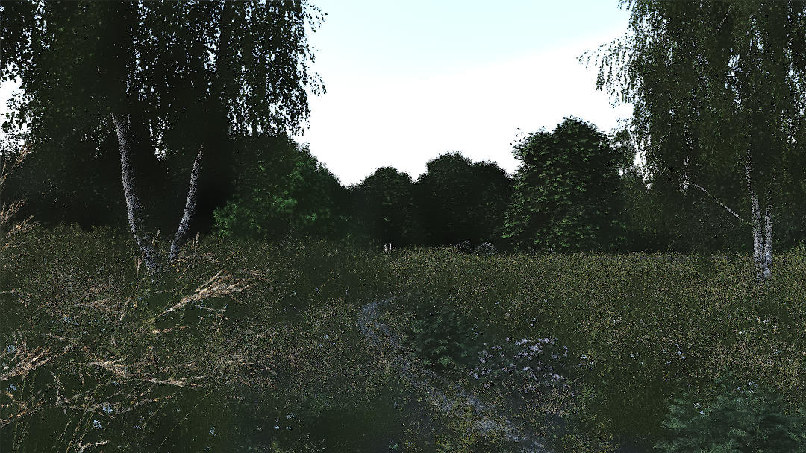

# **AI Denoising Draft**

Francesco Sassi 1661522

The code can be found at: https://github.com/francescosassi/ydenoise-fcg20

# **Introduction**

Part 1) I integrated [Intel® Open Image Denoise](https://openimagedenoise.github.io/) in yocto. I added the libray inside the yocto_extension module, ad modified the Cmake file to link on Windows, Linux and Mac. It was tested only on Windows and Linux but it is written to also support also macOS.
The yocto_extension module provides two interfaces one for the AI denoising that leverage the Intel® Open Image Denoise and another for the Non-Local Means Denoiser.

Part 2) I implemented a Non-Local Means Denoiser from this paper [Non-Local Means Denoising](https://www.ipol.im/pub/art/2011/bcm_nlm/article.pdf). The algorithm is easy and beautyful. For each pixel 'p' we  iterate over all pixel 'q' in a radius of size 'r'. For each 'q' we iterate in a second neighboroob of 'q' and of 'p' of size 'f' and check how close they are. If they are close (and how we define close is ruled by a paramter sigma), the pixel 'q' has a biggest weight in the average to computer the new value of 'p'.
The algorithm was implemented inside yocto_extension.cpp.
Since this algorithm can be computationally demanding, I implemented it in parallel, using the parallel_for.

I used the two functions that I created in yocto_extension to create a new app called <code>yimagedenoise</code>, that can be used to denoise an image with both those methods and take the following parameters:

THe options are:
* <code>--type,-t</code>: to specify if use the nlmeans or the Intel® Open Image Denoise
* <code>--albedo,-a</code>: albedo image used by the Intel® Open Image Denoise
* <code>--normal,-n</code>: normal image used by the Intel® Open Image Denoise
* <code>--sigma,-s</code>: the sigma parameter for the Non-Local Means Denoiser
* <code>--radius,-r</code>: the radius parameter for the Non-Local Means Denoiser
* <code>--frame,-f</code>: the frame parameter for the Non-Local Means Denoiser
* <code>--height,-h</code>: filtering parameter for Non-Local Means Denoiser
* <code>--outimage,-o</code>: the output image
* <code>image</code>: the input image

# **Tests**

One of the focus of this work is a torough testing of noth the algorithms under various conditions of noise intesnity. For this reason it was tested with images generated using a wide range of samples:

* 4 samples
* 8 samples
* 16 samples
* 64 samples
* 128 samples
* 256 samples

This is to study the different behaviour of the algorithm from a wide range of noise. In the case of 4 samples is basically reconstruction from a ruined image. For the case of 256 samples is just a fine grain noise remover. I included also image with very low samples just as a challenge to see how the algorithm can work under this extreme condition. 

The scene tested are large and realistic scenes. I used:

* Landscape
* Bistro exterior
* Bistro interior
* Classroom
* Head

In this way it is possible to see the behaviour of the algorithms under a wide range of scenario, from outside natural landscapes, to buildings both indoor and outdoor and on skin denoising.

Even if it is redundant, to simplify the comparison between the images they where arranged in this fashion:

* First image -> Noisy image
* Second image -> Intel® Open Image Denoise
* Third image -> Non-Local Means Denoiser
* Fourth image -> Full convergence Image

and this pattern is repeated for all the different samples the scenes where tested on.

# **Landscape**

## **Noisy Image (256 samples)**

  

## **Intel® Open Image Denoise (256 samples)**

## **Non-Local Means Denoiser (256 samples)**

## **Full convergence Image (1024 samples)**
  

 

## **Noisy Image (128 samples)**
  

## **Intel® Open Image Denoise (128 samples)**

## **Non-Local Means Denoiser (128 samples)**

## **Full convergence Image (1024 samples)**
  

 

## **Noisy Image (64 samples)**
  

## **Intel® Open Image Denoise (64 samples)**

## **Non-Local Means Denoiser (64 samples)**

## **Full convergence Image (1024 samples)**
  

 

## **Noisy Image (16 samples)**
  

## **Intel® Open Image Denoise (16 samples)**

## **Non-Local Means Denoiser (16 samples)**

## **Full convergence Image (1024 samples)**
  

 

## **Noisy Image (8 samples)**
  

## **Intel® Open Image Denoise (8 samples)**

## **Non-Local Means Denoiser (8 samples)**

## **Full convergence Image (1024 samples)**
  

 

## **Noisy Image (4 samples)**
  

## **Intel® Open Image Denoise (4 samples)**

## **Non-Local Means Denoiser (4 samples)**

## **Full convergence Image (1024 samples)**
  

 

# **bistroexterior**

## **Noisy Image (256 samples)**

  

## **Intel® Open Image Denoise (256 samples)**

## **Non-Local Means Denoiser (256 samples)**

## **Full convergence Image (1024 samples)**
  

 

## **Noisy Image (128 samples)**
  

## **Intel® Open Image Denoise (128 samples)**

## **Non-Local Means Denoiser (128 samples)**

## **Full convergence Image (1024 samples)**
  

 

## **Noisy Image (64 samples)**
  

## **Intel® Open Image Denoise (64 samples)**

## **Non-Local Means Denoiser (64 samples)**

## **Full convergence Image (1024 samples)**
  

 

## **Noisy Image (16 samples)**
  

## **Intel® Open Image Denoise (16 samples)**

## **Non-Local Means Denoiser (16 samples)**

## **Full convergence Image (1024 samples)**
  

 

## **Noisy Image (8 samples)**
  

## **Intel® Open Image Denoise (8 samples)**

## **Non-Local Means Denoiser (8 samples)**

## **Full convergence Image (1024 samples)**
  

 

## **Noisy Image (4 samples)**
  

## **Intel® Open Image Denoise (4 samples)**

## **Non-Local Means Denoiser (4 samples)**

## **Full convergence Image (1024 samples)**
  

 

# **Bistrot Interior**

## **Noisy Image (256 samples)**

  

## **Intel® Open Image Denoise (256 samples)**

## **Non-Local Means Denoiser (256 samples)**

## **Full convergence Image (1024 samples)**
  

 

## **Noisy Image (128 samples)**
  

## **Intel® Open Image Denoise (128 samples)**

## **Non-Local Means Denoiser (128 samples)**

## **Full convergence Image (1024 samples)**
  

 

## **Noisy Image (64 samples)**
  

## **Intel® Open Image Denoise (64 samples)**

## **Non-Local Means Denoiser (64 samples)**

## **Full convergence Image (1024 samples)**
  

 

## **Noisy Image (16 samples)**
  

## **Intel® Open Image Denoise (16 samples)**

## **Non-Local Means Denoiser (16 samples)**

## **Full convergence Image (1024 samples)**
  

 

## **Noisy Image (8 samples)**
  

## **Intel® Open Image Denoise (8 samples)**

## **Non-Local Means Denoiser (8 samples)**

## **Full convergence Image (1024 samples)**
  

 

## **Noisy Image (4 samples)**
  

## **Intel® Open Image Denoise (4 samples)**

## **Non-Local Means Denoiser (4 samples)**

## **Full convergence Image (1024 samples)**
  

## **Noisy Image (256 samples)**

  

## **Intel® Open Image Denoise (256 samples)**

## **Non-Local Means Denoiser (256 samples)**

## **Full convergence Image (1024 samples)**
  

 

## **Noisy Image (128 samples)**
  

## **Intel® Open Image Denoise (128 samples)**

## **Non-Local Means Denoiser (128 samples)**

## **Full convergence Image (1024 samples)**
  

 

## **Noisy Image (64 samples)**
  

## **Intel® Open Image Denoise (64 samples)**

## **Non-Local Means Denoiser (64 samples)**

## **Full convergence Image (1024 samples)**
  

 

## **Noisy Image (16 samples)**
  

## **Intel® Open Image Denoise (16 samples)**

## **Non-Local Means Denoiser (16 samples)**

## **Full convergence Image (1024 samples)**
  

 

## **Noisy Image (8 samples)**
  

## **Intel® Open Image Denoise (8 samples)**

## **Non-Local Means Denoiser (8 samples)**

## **Full convergence Image (1024 samples)**
  

 

## **Noisy Image (4 samples)**
  

## **Intel® Open Image Denoise (4 samples)**

## **Non-Local Means Denoiser (4 samples)**

## **Full convergence Image (1024 samples)**
  

## **Noisy Image (256 samples)**

  

## **Intel® Open Image Denoise (256 samples)**

## **Non-Local Means Denoiser (256 samples)**

## **Full convergence Image (1024 samples)**
  

 

## **Noisy Image (128 samples)**
  

## **Intel® Open Image Denoise (128 samples)**

## **Non-Local Means Denoiser (128 samples)**

## **Full convergence Image (1024 samples)**
  

 

## **Noisy Image (64 samples)**
  

## **Intel® Open Image Denoise (64 samples)**

## **Non-Local Means Denoiser (64 samples)**

## **Full convergence Image (1024 samples)**
  

 

## **Noisy Image (16 samples)**
  

## **Intel® Open Image Denoise (16 samples)**

## **Non-Local Means Denoiser (16 samples)**

## **Full convergence Image (1024 samples)**
  

 

## **Noisy Image (8 samples)**
  

## **Intel® Open Image Denoise (8 samples)**

## **Non-Local Means Denoiser (8 samples)**

## **Full convergence Image (1024 samples)**
  

 

## **Noisy Image (4 samples)**
  

## **Intel® Open Image Denoise (4 samples)**

## **Non-Local Means Denoiser (4 samples)**

## **Full convergence Image (1024 samples)**
  

# **Conclusion**
The main problem for the Non-Local Means Denoiser are large patches of noise. If there are large zones of noise it is needed to increase the size of the research windows because it can be difficult to find pixels that are similar to the right color of the image. THis can slow down the algorithm a lot. Moreover, another problema is when the color of the noise is too far away from the color of the background. One of the assumption of the algorithm is that the noise is generated with a gaussian distribution of paramter sigma. If the noise is too far away from the actual color of the image it is needed to increase the parameter sigma, that can lead to blurring in some zones of the image.
The performances for the Intel® Open Image Denoiser are impressive, and it is able to reconstruct the image even from low samples. With images with low noise it tends to blur some parts a there is a loss of some details (mainly sharpness).

# **Considerations on performances**
The tests where run on an intel i7-6700HQ.
The Intel® Open Image Denoise is blazing fast.  It takes at maximum 2 seconds To denoise an image.
The Non-Local Means Denoiser can be super fast or super slow according to the parameters.
In some cases, when there is a few noise to remove (256 samples / 128 samples) it can takes 5 seconds.
For images that are harder to denoise and require a larger windows of search it can take minutes.